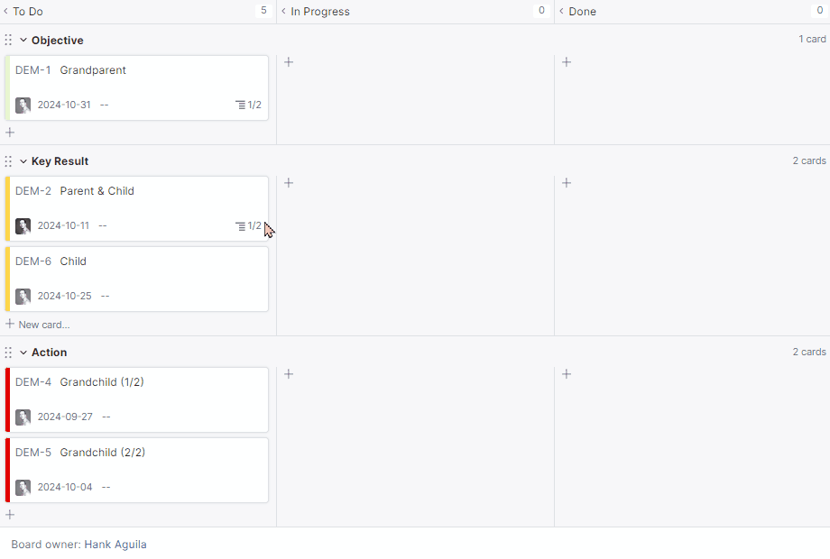
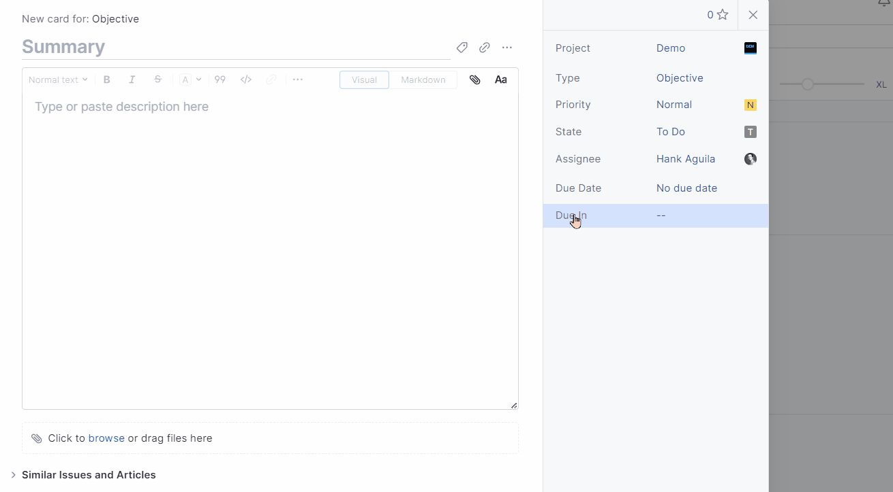

# YouTrack Workflows++

This project offers custom workflows for
_[YouTrack](https://www.jetbrains.com/help/youtrack/server/introduction-to-youtrack-server.html)
2024.3.44799_, addressing gaps in native functionality. It extends YouTrack's
capabilities by automating tasks not yet supported in the platform.

## Contents

- [Install](#install)
- [Workflows](#workflows)
- [License](#license)

## Install

Download the latest [release](https://github.com/hankaguila/youtrack-workflows/releases)
and then:

1. Navigate to `https://<youtrack-server>/admin/workflows`
2. Click Add workflow -> Upload ZIP file...
3. Select downloaded ZIP

## Workflows

- [bind-parent-to-subtasks](src/youtrack-workflow-bind-parent-to-subtasks/bind-parent-to-subtasks.js)

- [update-due-in](src/youtrack-workflow-due-in/due-in.js)

## License

[MIT](LICENSE)
